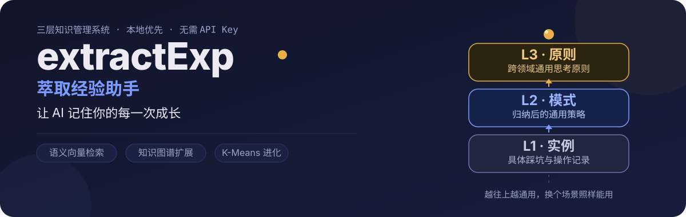
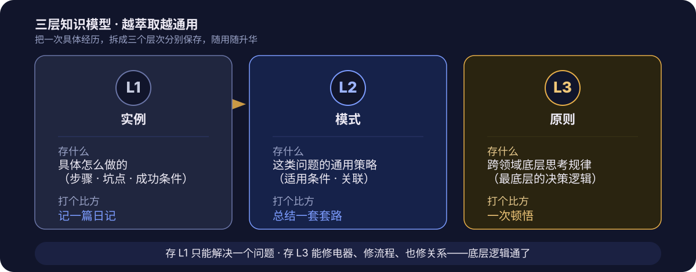
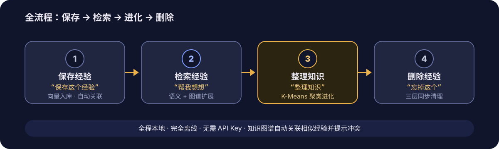

<p align="center">
  
</p>

> **extractExp（萃取经验助手）** —— 让 AI 记住你的每一次成长。
> 专为普通用户设计，无需编程，只需三句人话。所有数据本地存储，完全离线，无需 API Key。

---

## 三层知识模型：越萃取越通用

普通工具帮你"记住"步骤，extractExp 帮你"成长"——把一次具体的解决问题过程，拆成三个层次分别保存，越往上越通用。

<p align="center">
  
</p>

- **L1 实例** —— 这次具体怎么做的：步骤、坑点、成功条件。像记一篇日记。
- **L2 模式** —— 这类问题的通用策略与适用条件。像总结一套套路。
- **L3 原则** —— 跨领域最底层的思考规律。像一次顿悟，换个场景照样能用。

存了 L1，你只能解决"换管子"这一个问题；存了 L3，你能修电器、修流程、也修关系——**底层逻辑通了**。

---

## 为什么不是又一个"记步骤"的工具

现在的工具把你的思考压平成一份死步骤清单：记的是"打开 A 网站 → 复制 B 列 → 粘贴到 C 表"。可你真正想要的，是"面对杂乱数据时，先看表头 → 判断类型 → 选清洗方法 → 验证结果"这套**活的决策逻辑**。

extractExp 不存步骤，存经验。它让每一次解决问题，都变成下一次的"底牌"，而不是"病历"——**让人越用越聪明，而不是越用越依赖死记硬背。**

---

## 全流程：保存 → 检索 → 进化 → 删除

<p align="center">
  
</p>

三句人话，开启无限记忆：

| 你说的话 | AI 做的事 |
| --- | --- |
| **“保存这个经验”** | 自动整理步骤、策略、坑点，永久保存并关联相似经验 |
| **“帮我想想”** | 遇到新问题，秒搜你的历史智慧，像老师傅一样给建议 |
| **“整理知识”** | 周期性自动归纳通用方法论，让经验持续升级 |

---

## 快速开始

1. 下载并解压本项目到**英文路径**（例如 `D:/extractExp` 或 `/home/xxx/extractExp`）。
2. 安装依赖：
   - Windows：双击 `scripts/install.bat`
   - Mac / Linux：手动执行 `pip install -r scripts/requirements.txt`
3. 打开 WorkBuddy → 切换到 **Craft 模式** → 导入 `extractExp/SKILL.md`。
4. 在聊天框输入（注意斜杠方向）：
   ```
   设置萃取经验助手路径为 D:/extractExp
   ```
5. 等待初始化完成（首次会自动下载约 188MB 的本地嵌入模型，模型缓存后无需重下）。

> **前提**：需要 Python 3.8+ 且 `python` 命令在 PATH 中（可执行 `python --version` 检查）；请配合 WorkBuddy 的 **Craft 模式** 使用。

---

## 进阶：知识图谱与冲突检测

- 每次保存时，AI 会自动提取关键实体与关系（例如"Selenium **解决** 懒加载问题"），构建你的**个人知识图谱**。
- 整理知识时，若新发现与旧策略冲突（余弦相似度过高），AI 会提醒你更新，防止知识过时。
- 检索时通过 `related` 字段与图谱做多跳扩展，把分散的经验连成网络。

---

## 数据所有权

所有数据（经验 JSON、向量库、知识图谱、嵌入模型）都存储在 `exps/` 目录下。直接把整个项目文件夹拷贝到其他电脑即可使用——**你的经验只属于你**。

---

## 常见问题

- **首次初始化卡住？** 嵌入模型约 188MB，请耐心等待下载（含自动重试）。
- **提示 `python` 不是内部命令？** 安装 Python 时请勾选 "Add to PATH"。
- **Mac / Linux 路径？** 使用正斜杠，如 `/home/xxx/extractExp`。

---

## 许可证

许可证以仓库根目录 `LICENSE` 文件为准；若未提供，商用前请先联系作者确认使用范围。
